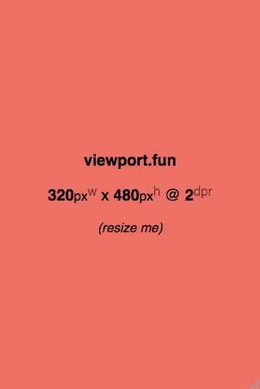

# viewport.fun

[http://viewport.fun ](http://viewport.fun)

A tiny SPA that prints your viewport's width, height, and dpr.

_Provides a quick and easy way to read the viewport of a foreign device._
